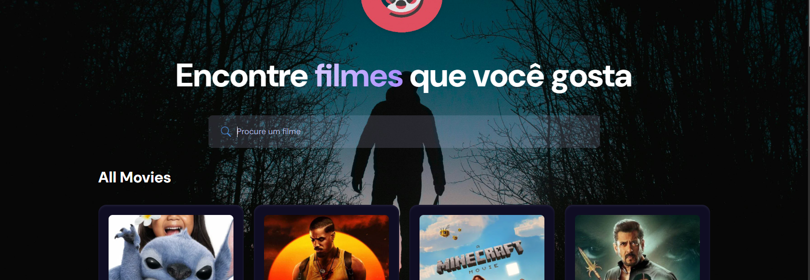

<div align="center">


<div>
    
    
</div>

<h2 align="center">🎬 film-react</h2>

**film-react** is a web application built with **React 19**, **Vite**, and **Tailwind CSS**. It allows users to search and discover movies using the [TMDB (The Movie Database)](https://www.themoviedb.org/) API.

</div>

## 🚀 Technologies Used

- ⚛️ **[React 19](https://react.dev/blog/2024/04/25/react-19)**
- ⚡ **[Vite](https://vitejs.dev/)** — a fast build tool for modern web development
- 🎨 **[Tailwind CSS](https://tailwindcss.com/)** — a utility-first CSS framework
- 🎥 **[TMDB API](https://developer.themoviedb.org/)** — movie and TV show database

## 🖼️ Features

- Search for movies by name
- View movie cards with posters
- Responsive and user-friendly interface
- Modern UI focused on user experience

## 🧪 How to run locally

```bash
# Clone the repository
git clone https://github.com/your-username/film-react.git

# Navigate to the project folder
cd film-react

# Install dependencies
npm install

# Create a .env file with your TMDB API key
echo "VITE_TMDB_API_KEY=your_api_key_here" > .env

# Run the project
npm run dev
```

---
.<br>.<br>.

## 📄 Licença

Este projeto está licenciado sob a licença MIT. Veja o arquivo `LICENSE` para mais detalhes.

## ✍️ Autor
<table align="center">
<tr>
<td align="center">
<a href="https://github.com/Truefenix">

<br />
<sub><b>Trufenix</b></sub>
</a>
</td>